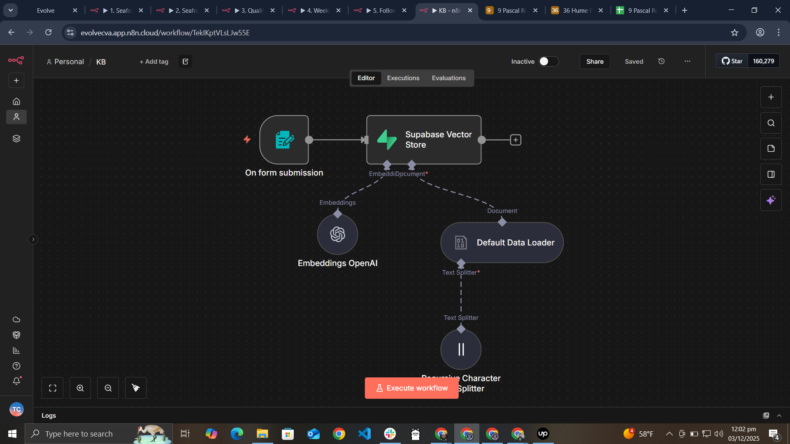
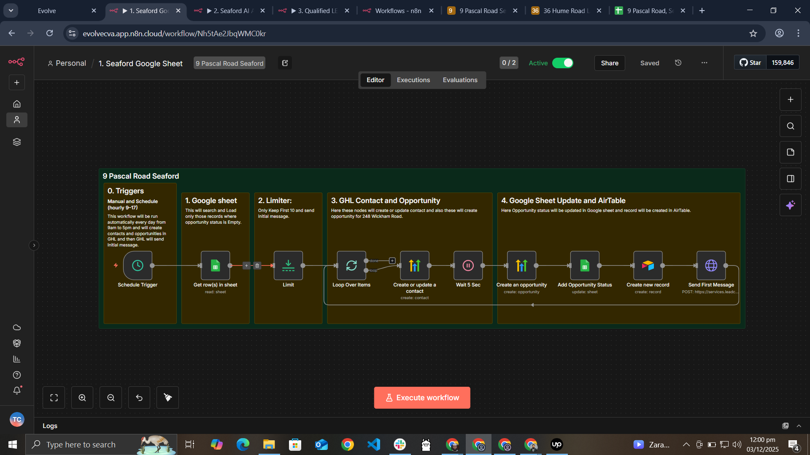
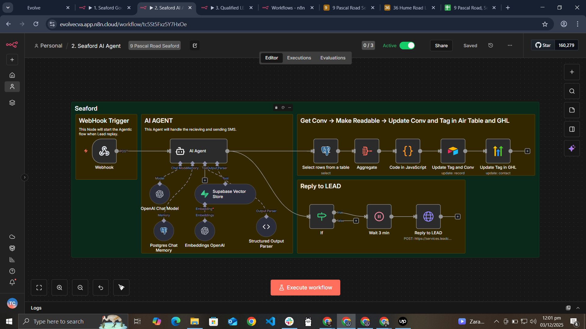
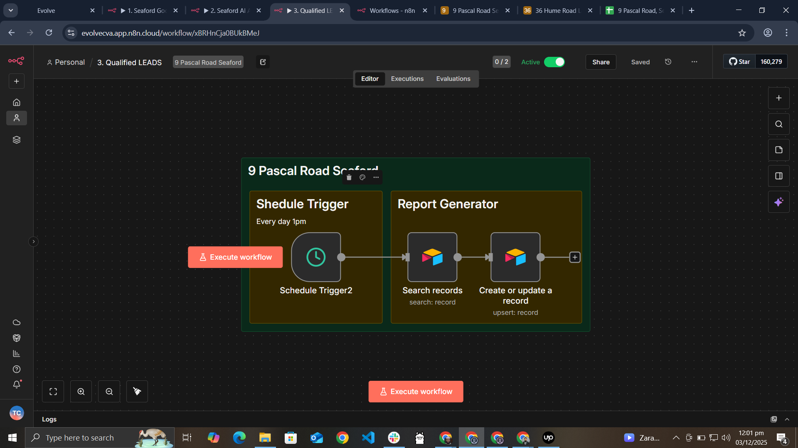
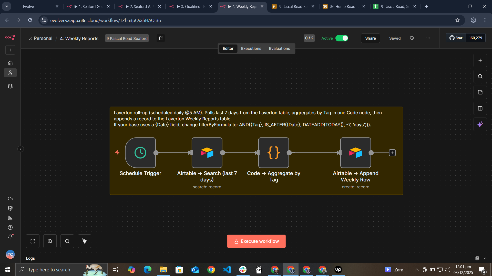
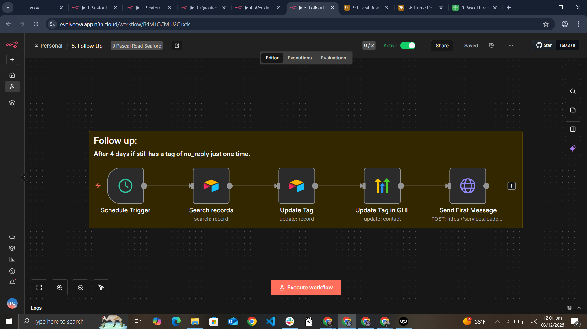
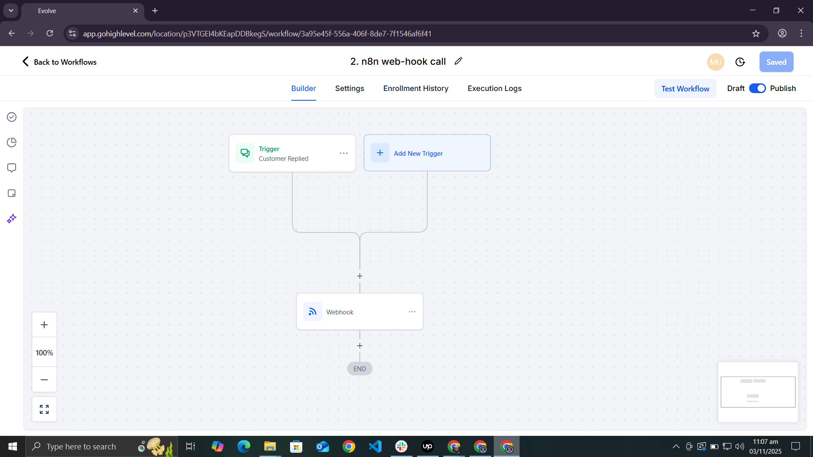

# GHL + n8n AI Lead Automation (Laverton)

Images:









End-to-end lead automation for a real-estate development using **n8n**, **GoHighLevel (GHL)**, **OpenAI**, **Airtable**, **Google Sheets**, **Supabase**, and **Postgres**.

The system:

1. Pulls new leads from Google Sheets into GHL  
2. Lets GHL send the first SMS  
3. Listens for customer replies via webhook  
4. Uses an AI sales assistant to respond and score the lead  
5. Syncs conversations and tags into Airtable  
6. Builds qualified-lead lists, weekly reports and automated follow-ups  
7. Stores PDF knowledge in a vector database for retrieval-augmented replies

---

## Architecture Overview

### 0. Knowledge Base – PDF → Supabase Vector Store

An n8n workflow called **`KB`** exposes a public form where a user uploads a PDF.  
The file is loaded, split into chunks and stored as OpenAI embeddings in a Supabase `documents` table. :contentReference[oaicite:0]{index=0}  

These documents are later queried by the AI Agent as a retrieval tool so replies can use property-specific knowledge.

---

### 1. Google Sheet → GHL & Airtable

Workflow: **`1. Google Sheet -> GHL`** :contentReference[oaicite:1]{index=1}  

* Triggered on a **schedule** (every 30 minutes between 9:00–17:00).
* Reads rows from a Google Sheet where **`Opportunity Status` is empty**.
* Limits to the first **10** rows per run.
* For each row:
  * Creates/updates a **GHL contact** with name, email, phone and a `no reply` tag.
  * (In GHL) an opportunity is created and the **initial SMS** is sent by a GHL workflow.
  * Updates the Google Sheet row with `Opportunity Status = "Created"`.
  * Creates a matching record in Airtable **LEADS** with fields such as number, name, email, tag, GHL Contact ID and `No Follow Ups = 0`.

This workflow is the entry point feeding fresh leads into the automated system.

---

### 2. AI Agent – Handling Customer Replies

Workflow: **`2. AI Agent`** :contentReference[oaicite:2]{index=2}  

* **Trigger:** GHL workflow “Customer Replied” calls a webhook in n8n (path like `/36-Hume-Road-Laverton`) whenever a lead replies.
* **Chat Memory:** Conversation history for each contact is stored in Postgres (`laverton_chat_memory`) and loaded using a LangChain Postgres Chat Memory node.
* **Retrieval:** The Supabase vector store (loaded by the KB workflow) is available as a tool so the model can pull property-specific information.
* **Model:** `gpt-4.1` via a LangChain ChatOpenAI node with a detailed system prompt:
  * Acts as a **warm, professional AI sales assistant** for the Laverton development.
  * Asks qualification questions (use vs investment, budget, timeframe).
  * Marks a lead as **Qualified** only if budget ≥ 700k AUD and timeframe ≤ 3 months.
  * Otherwise classifies as *Warm but not qualified, Not interested, Interested in another property, Needs a call for another reason, Wants info pack, Do not contact*, etc.
* **Output:** The model returns a strict JSON object:
  ```json
  {
    "reply": "<SMS to send>",
    "tagging": {
      "tag": "<one of the controlled tags>",
      "rationale": "<short explanation>"
    }
  }
A structured output parser extracts `reply` and `tagging`.

n8n sends the reply back to the lead using the **GHL Conversations API**  
(HTTP `POST` to `services.leadconnectorhq.com/conversations/messages` with:

- `type = "SMS"`
- message body
- `contactId`
).

Another branch:

- Reads full conversation history from **Postgres**.
- Uses a **Code** node to build a human-readable transcript.
- Updates the Airtable **LEADS** table with:
  - latest **Tag**
  - **Rationale**
  - **Conversations** transcript text.

**Result:** every inbound SMS is answered automatically, and every lead is classified and synced to Airtable.

---

## 3. Qualified LEADS Roll-up

**Workflow:** `3. Qualified LEADS` (`3-Qualified-LEADS`)

- Triggered daily (e.g. **1 PM**).
- Searches Airtable **LEADS** where `Tag = "Qualified"`.
- Upserts into a separate Airtable table **Qualified LEADS** keyed by `Number`.
- Copies over:
  - `Number`
  - `Name`
  - `Email`
  - `Tag`
  - conversation summary
  - rationale
- Sets `LEAD Status = "Not Called"`.

**Result:** creates a clean call list for the sales team to action.

---

## 4. Weekly Reports

**Workflow:** `4. Weekly Reports` (`4-Weekly-Reports`)

- Searches Airtable **LEADS** for records:
  - with a **Tag** present, and
  - created in the **last 7 days**.
- A **Code** node counts leads by outcome:
  - No Reply  
  - Warm But Not Qualified  
  - Not Interested  
  - Interested in Another Property  
  - Qualified  
  - Needs A Call for another reason  
  - Do Not Contact  
  - Wants Info Pack  
  - Followed Up – No Reply
- Writes a single aggregate row into  
  **Weekly Reports 36 Hume Road Laverton** with those counts.

**Result:** provides a simple weekly performance snapshot of the AI funnel.

---

## 5. Follow-Up Automation

**Workflow:** `5. Follow Up` (`5-Follow-Up`)

- Triggered on a schedule (e.g. **daily**).
- Searches Airtable **LEADS** for records where:
  - `Tag = "no reply"`
  - `No Follow Ups = 0`
  - `Created` more than **4 days ago**
- For each eligible lead:
  - Updates Airtable:
    - `No Follow Ups = 1`
    - `Tag = "followed up - no reply"`
  - Updates the contact’s **tag in GHL** to match.
  - Sends a follow-up SMS via the **GHL Conversations API**, gently checking if they’re still interested.

**Result:** leads receive one respectful follow-up before being treated as inactive.

---

## Tech Stack

- **n8n** – workflow orchestration  
- **GoHighLevel (LeadConnector)** – CRM, SMS and conversation handling  
- **OpenAI / gpt-4.1** – AI sales assistant  
- **LangChain** – model, memory and vector store integrations  
- **Supabase** – documents vector store for PDF knowledge  
- **Postgres** – long-term chat memory  
- **Airtable** – LEADS table, Qualified LEADS, Weekly Reports  
- **Google Sheets** – initial lead list / data source
